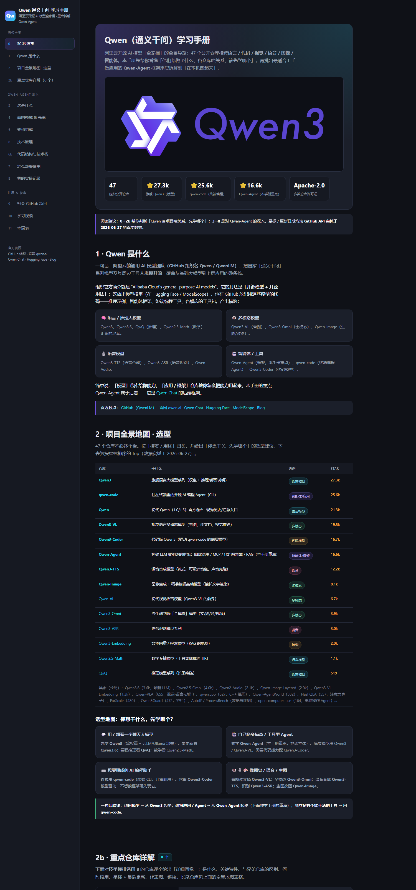

<!-- Language: [中文](README.md) · **English** -->

# ai-learning-skills

> Use AI to turn anything — a GitHub project, a tech organization, an unfamiliar field,
> a technical book — into an **interactive, offline, media-rich learning page**.


<p align="center"><sub>↑ Just say "help me learn github.com/openai/whisper" — this page is generated automatically: left TOC, right content, the official architecture diagram downloaded locally, real star counts, click-to-zoom on images.</sub></p>

---

## Sound familiar? (Meet "Xiao Yang")

> *In Chinese workplaces, "**Xiao Yang**" (小杨, lit. "Young Yang") is the casual, slightly paternal way a boss addresses the go-to junior on the team — the one who gets handed every "hey, go figure this out for us."*

Your boss keeps dropping links on you:

> “**Xiao Yang**, I saw this **GitHub project** online — go learn it, let's start using it.”
>
> “**Xiao Yang**, check out this **org**, they've shipped a ton lately — we could do this too, make it happen.”
>
> “**Xiao Yang**, a **competitor** just open-sourced something — dig in, see if we can use it or beat it.”
>
> “**Xiao Yang**, someone dropped this **arXiv paper** in the group chat — is it legit, can we actually ship it?”
>
> “**Xiao Yang**, I think this whole **field** has legs — research it and build me a proof of concept.”
>
> “**Xiao Yang**, this **book** covers exactly the tech we need — get on top of it and brief the team.”

And Xiao Yang's inner monologue is always the same:

> “…boss, I don't actually know this yet. Let me *look into it*, let me *go learn it*, let me *go research it*…”

So you open that README — thousands of lines, all jargon, images broken on an external CDN.
You open that org — a dozen repos, no idea which is the main act or where to start.
You open that paper and that field — dozens of papers, blogs, videos, no clear entry point.
**You'll learn it eventually, but grinding through raw material is slow, dry, and easy to lose the plot.**

**How do you get up to speed on something unfamiliar, fast?** That's what these skills are for —
they let AI **digest, fact-check, and organize** the source into a structured learning page
*for* you, so you open it and start learning instead of hunting through a haystack of raw material.

---

## What it does

Give it a source; it runs **research → structure → generate** and produces a **double-click,
offline, shareable** learning page: left TOC, right content, with the source's own diagrams,
screenshots, and video covers downloaded locally — plus a glossary, a code-structure
walkthrough, and interactive learning pieces.

The whole family shares **one look, one set of interactions, and one "faithful, never
fabricated" rule** — whatever you learn, the experience is consistent and every number is
from a real fetch.

| Skill | Source it learns from | Status |
|-------|----------------------|--------|
| **[github-project-learn](skills/github-project-learn)** | A GitHub repo or a whole organization | ✅ Done |
| **[domain-learn](skills/domain-learn)** | An open topic researched across the web (e.g. "3DGS", "diffusion models") — a beginner→advanced→hands-on roadmap with interactive demos | ✅ Done |
| **textbook-learn** | A specific technical book / PDF — chapter by chapter, with active-recall quizzes and worked examples | 🔜 Planned |

Each skill is **self-contained and individually installable** — you don't need the whole repo to use one.

## Preview

A **single repo** and a **whole organization** automatically get different page structures:

| Single project (e.g. OmAgent) | Whole org (e.g. QwenLM) |
|---|---|
|  |  |
| Straight to the deep dive: what-it-is / architecture / principle / **code structure** / deploy | An extra layer: **project map + selection guide** + a **detailed profile per key repo** + flagship deep dive |

How complete is org mode? Here's the QwenLM page **scrolled top to bottom** — overview, a project map sorted by real star counts, a "what do you want to do → start here" guide, then the per-repo profiles:



Built into every page: sticky TOC with scroll-spy, click-to-zoom on images, copy buttons on code, and a searchable glossary.

Want to see real output right now? [`samples/`](samples/) has complete, offline-openable examples (just double-click `index.html`).

## What the output looks like

A folder with no build step, no server, fully offline:

```
<thing>-learn/
├── index.html      # self-contained (inline CSS+JS), double-click to open
├── assets/         # the source's real images / diagrams / media, downloaded
└── scripts/        # optional helper scripts (e.g. env-check / setup, dry-run by default)
```

## Install

**Option A — packaged `.skill` file** (from a Release): drag it into Claude Code's skill installer.

**Option B — from source**: copy a skill folder into your skills directory:

```bash
cp -r skills/github-project-learn ~/.claude/skills/
```

Then just say something like *"help me learn github.com/openai/whisper"* and the skill triggers.

## Repo structure

```
ai-learning-skills/
├── skills/                     # each subfolder is one installable skill
│   └── github-project-learn/
├── shared/                     # canonical design system reused across skills
│   ├── template.html           # the page shell (CSS + interaction JS)
│   ├── learning-page-design.md # the design-system spec
│   └── fetch-media.sh          # robust media downloader (LFS / proxy aware)
└── docs/
    └── adding-a-new-skill.md    # conventions for the next one
```

**On `shared/`:** because skills must stay self-contained to install on their own, each
skill bundles its **own copy** of the shared template/scripts. `shared/` is the **source of
truth** — improve the design system here, then re-sync into each skill. See
[docs/adding-a-new-skill.md](docs/adding-a-new-skill.md).

## Principles

- **Faithful, never fabricated.** Stars, dates, media URLs, results — all from real fetches. If a thing doesn't exist (e.g. no learning video), the page says so.
- **Offline-first.** Media is downloaded; pages open by double-click and are trivially shareable.
- **Consistent design.** One shell, one set of interactions, across the family.
- **Source over summary.** Diagrams, real code structure, and primary sources beat a paraphrase.

## Roadmap

- [x] `github-project-learn` — repos & organizations
- [x] `domain-learn` — web-researched topic roadmaps with interactive demos (built on rigorous, cited research) — examples: [3DGS](samples/domain-learn/3dgs-learn/index.html), [diffusion models](samples/domain-learn/diffusion-models-learn/index.html)
- [ ] `textbook-learn` — book/PDF courses with active recall
- [ ] Extract the shared design core once the second skill confirms what's truly common

## License

MIT — see [LICENSE](LICENSE).
