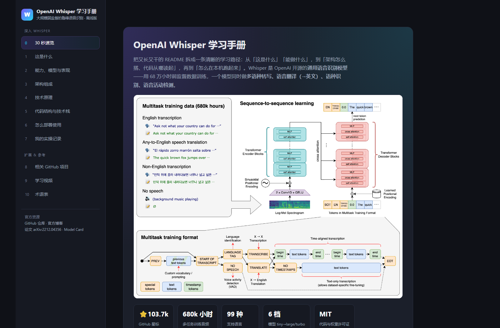
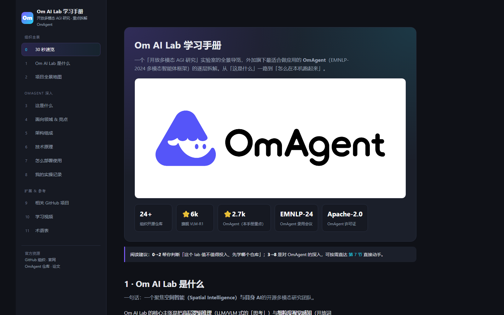
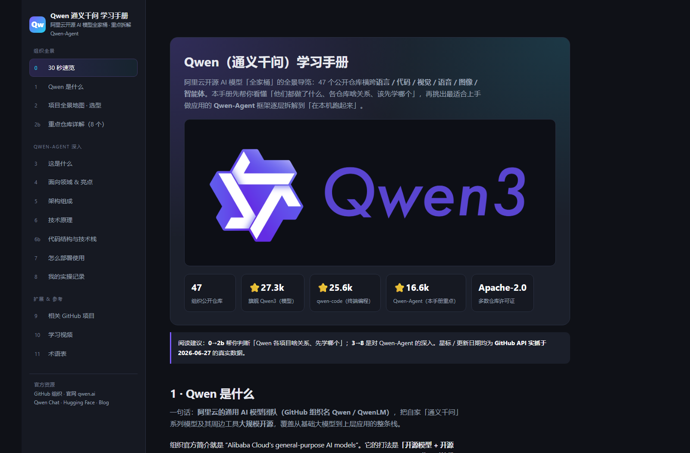

<!-- 语言 / Language: **中文** · [English](README.en.md) -->

# ai-learning-skills

> 用 AI 把一个 **GitHub 项目 / 论文 / 技术书 / 陌生领域**，快速变成一份**带图、可交互、能离线打开和分享**的学习网页。
> 为**快速上手、个人学习**而生——刻意轻量：一个自包含 HTML，双击即开，可单独用、也可合并用。



<p align="center"><sub>↑ 一句「帮我学习 github.com/openai/whisper」自动生成：左目录右内容、官方架构图已下载到本地、真实星标、图片可点击放大</sub></p>

---

## 你是不是「小杨」

老板隔三差五甩来一句：「**小杨**，这个 GitHub 项目去学学 / 这篇 arXiv 瞅瞅靠不靠谱 / 这个领域研究下 / 这本书先吃透。」
你打开却是几千行 README、十几个仓库不知从哪看起、几十篇论文无从下手——**学是要学的，硬啃又慢又抓不住重点。**

这套 skill 让 AI 先替你把来源**嚼碎、核实、整理**成一份循序渐进的学习网页：打开就能学，而不是大海捞针。

## 定位（也是边界）

- 🚀 **为「快速学习、快速摸清」而生**——先看懂、先上手，不是写权威手册。
- 👤 **个人学习优先**——给自己用，不是团队 wiki / 文档站 / 知识库系统。
- 📄 **产物是单个静态 HTML，可分享**——自包含、可离线、双击即开；没有构建 / 服务器 / 依赖。
- 🧩 **可单独用，也可合并用**——每个 skill 独立安装独立触发；想要总入口就用 `/learn` 自动分流。
- 🪶 **刻意轻量**——一次抓取整理 + 一个静态页，要更新就重跑，不堆重型基建。

## 四个 skill（按来源）

| Skill | 学习的来源 |
|-------|-----------|
| **[github-project-learn](skills/github-project-learn)** | 一个 GitHub 仓库或整个组织 |
| **[domain-learn](skills/domain-learn)** | 一个开放领域（如 3DGS、扩散模型）→ 入门→进阶→实践 路线 + 可交互 demo |
| **[textbook-learn](skills/textbook-learn)** | 一本技术书 / PDF → 按章拆课程 + 例题精讲 + 主动回忆测验 |
| **[paper-learn](skills/paper-learn)** | 一篇论文 / arXiv → 逐图拆方法 + 离线公式 + 机制 demo + 批判性阅读 |

一个总入口 **[`/learn`](skills/learn)**：丢任何来源，自动判型分流到上面对应的 skill（模糊先问一句）。每个 skill 也能**独立安装、单独触发**——用一个不需要整个仓库。坚持**真实不编造**：数据全来自真实抓取，没有就如实说明。

> 真实产出直接打开看：[`samples/`](samples/) 里每个 skill 都有离线案例（双击 `index.html`）。

## 效果预览

**单仓库** 与 **整个组织** 自动走不同结构：

| 单个项目（如 OmAgent） | 整个组织（如 QwenLM） |
|---|---|
|  |  |
| 直接深入：是什么 / 架构 / 原理 / 代码结构 / 部署 | 多一层：全景选型 +「重点仓库逐个详解」+ 旗舰深入 |

每页内置：吸顶目录 + 滚动高亮、图片点击放大、代码一键复制、术语表实时搜索。

## 产出长什么样

一个无需构建、无需服务器、完全离线的文件夹：

```
<thing>-learn/
├── index.html   # 自包含(内联 CSS+JS)，双击即开
└── assets/      # 来源真实的图片 / 架构图 / 媒体，已下载到本地
```

## 安装与使用

- **打包文件**：从 Release 下载 `.skill`，拖进 Claude Code 的 skill 安装器。
- **从源码**：`cp -r skills/<name> ~/.claude/skills/`。

装好后对 Claude 说一句，比如 *「帮我学习 github.com/openai/whisper」*，对应 skill 自动触发。

## 路线图

四个来源 skill + `/learn` 入口都已完成（见上表与 [`samples/`](samples/)）。接下来：

- [ ] 往深做：textbook 测验导出 Anki / 间隔重复；多源融合（一个主题 = 论文 + repo + 领域）
- [ ] 新来源候选：video/course-learn（视频/讲座 → 转录笔记 + 时间戳）、docs-learn（文档站）
- [ ] 抽出真正共享的内核（页面外壳已共享，研究 / 教学法层待看）

> 想加新 skill？见 [docs/adding-a-new-skill.md](docs/adding-a-new-skill.md)。`shared/` 是设计内核的单一事实来源（每个 skill 自带一份拷贝以便独立安装）。

## 许可证

MIT —— 见 [LICENSE](LICENSE)。
