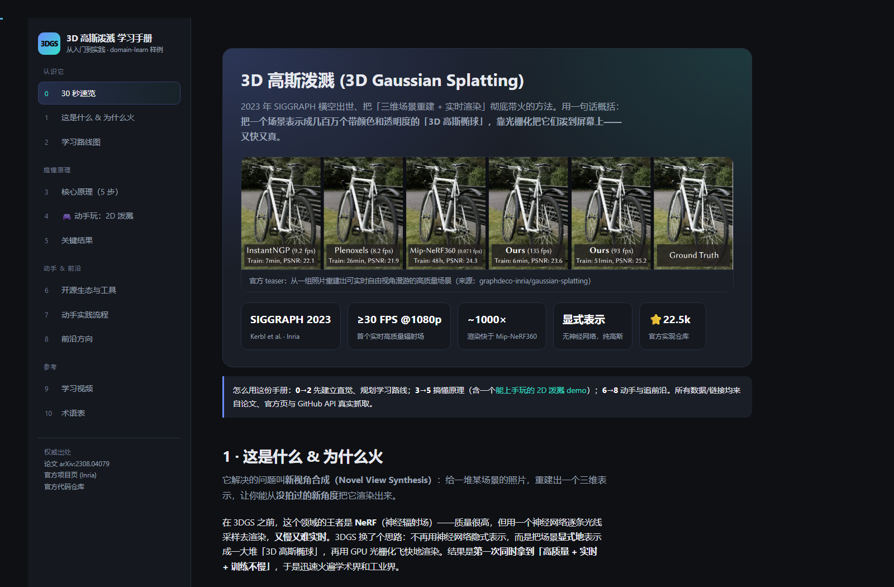
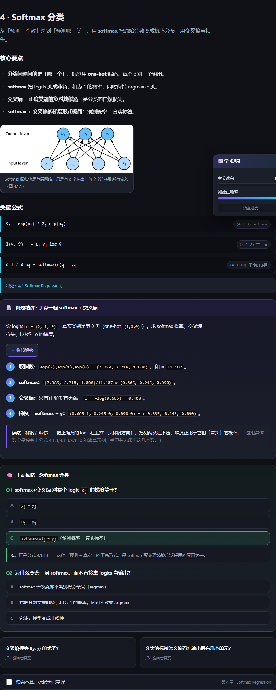
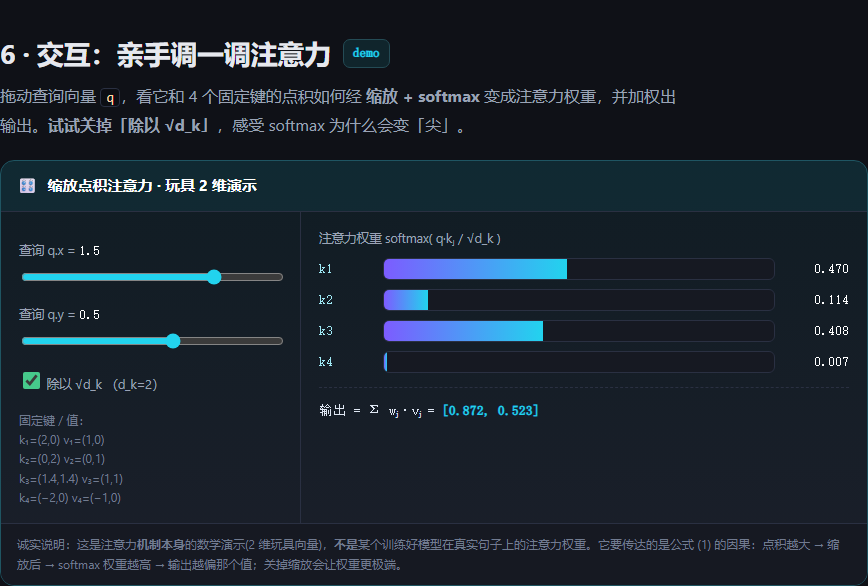
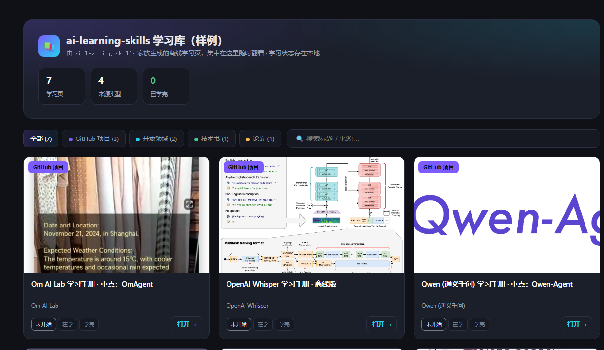

# Samples — 真实产出案例 / real generated outputs

这里放的是用本仓库的 skill **真实生成**的学习页（连同下载好的媒体），可以直接打开看效果，
不用自己先跑一遍。按**产出它的 skill** 分类存放。

These are **real** learning pages produced by the skills in this repo (media included),
organized by **which skill generated them**. Open them directly — no need to run anything first.

```
samples/
├── github-project-learn/   # 学一个 GitHub 仓库 / 组织
│   ├── whisper-learn/       # 单仓库
│   ├── qwenlm-learn/        # 整个组织
│   └── om-ai-lab-learn/     # 组织 + 旗舰深入
├── domain-learn/           # 学一个开放领域
│   ├── 3dgs-learn/          # 3D 高斯泼溅
│   └── diffusion-models-learn/  # 扩散模型
├── textbook-learn/         # 学一本技术书 / PDF
│   └── d2l-learn/           # 《动手学深度学习》逐章 + 测验
├── paper-learn/            # 精读一篇论文 / arXiv
│   └── attention-learn/     # Attention Is All You Need 逐图 + 交互 + 批判性阅读
└── learn-hub/              # 学习库 hub —— 上面所有页的离线聚合首页（由 learn 生成）
    └── index.html
```

## `github-project-learn/` — 学一个 GitHub 仓库或组织

| 案例 | 来源 | 模式 | 怎么看 |
|------|------|------|--------|
| [`whisper-learn/`](github-project-learn/whisper-learn/index.html) | [openai/whisper](https://github.com/openai/whisper) | **单仓库** | 双击 `index.html` |
| [`qwenlm-learn/`](github-project-learn/qwenlm-learn/index.html) | [github.com/QwenLM](https://github.com/QwenLM) + 旗下 Qwen-Agent | **整个组织** | 双击 `index.html` |
| [`om-ai-lab-learn/`](github-project-learn/om-ai-lab-learn/index.html) | [github.com/om-ai-lab](https://github.com/om-ai-lab) + 旗下 OmAgent | **组织 + 旗舰深入** | 双击 `index.html` |

**whisper-learn** —— **单仓库模式**示例：对 OpenAI 的 Whisper 直接深入——是什么 / 能力 / 架构（含官方
seq2seq 架构图）/ 技术原理 / **代码结构与技术栈** / 部署。适合看「单个项目」长什么样。

**qwenlm-learn** —— **组织模式**完整示例：阿里 Qwen「全家桶」的全景选型 + **8 个重点仓库逐个详解** +
旗舰 Qwen-Agent 深入（含 **代码结构与技术栈**）。星标/日期均为 GitHub API 真实抓取。适合看「整个组织」长什么样。

**om-ai-lab-learn** —— 由 `github-project-learn` 生成的第一份手册：把「Om AI Lab」这个开放多模态
研究组织连同它最适合上手的 **OmAgent** 一起拆开讲，从「这是什么」一路到「怎么在本机跑起来」，
含组织全景、架构图、技术原理、学习视频、术语表，媒体全部下载到本地、可离线打开。

## `domain-learn/` — 学一个开放领域（不是单个仓库）

| 案例 | 来源 | 亮点 | 怎么看 |
|------|------|------|--------|
| [`3dgs-learn/`](domain-learn/3dgs-learn/index.html) | 「3D 高斯泼溅」开放领域（论文/生态/资源） | 可交互 **2D 高斯泼溅** playground | 双击 `index.html` |
| [`diffusion-models-learn/`](domain-learn/diffusion-models-learn/index.html) | 「扩散模型」开放领域（DDPM/LDM/生态） | 可交互 **加噪 / 去噪** demo | 双击 `index.html` |

**3dgs-learn** —— `domain-learn` 的首个样例：把「3D 高斯泼溅」从入门到实践整理成一页——学习路线图、
5 步核心原理、关键结果、开源生态（真实星标）、动手流程、前沿方向、学习视频、术语表，**外加一个可
交互的「2D 高斯泼溅」playground**（拖滑块感受 "高斯越多越清晰" 的致密化直觉）。所有论文/数据/链接均带出处。

**diffusion-models-learn** —— `domain-learn` 的第二个样例：把「扩散模型」从入门到实践整理成一页——
是什么 & 为什么重要、学习路线图、核心原理（前向加噪 `x_t=√ᾱ_t·x₀+√(1−ᾱ_t)·ε` / 反向去噪 / DDPM 算法 /
潜在扩散架构，配 Lilian Weng 原图）、里程碑、开源生态（真实星标）、动手实践、前沿方向、学习视频、术语表，
**外加一个可交互的「加噪 / 去噪」demo**：拖「时间步 t」实时加噪（数学精确），点「▶去噪生成」回放反向过程。



## `textbook-learn/` — 学一本技术书 / PDF

| 案例 | 来源 | 亮点 | 怎么看 |
|------|------|------|--------|
| [`d2l-learn/`](textbook-learn/d2l-learn/index.html) | 《动手学深度学习》[d2l.ai](https://d2l.ai)（23 章开源教科书） | **逐章例题精讲 + 自评测验 + 进度追踪** | 双击 `index.html` |

**d2l-learn** —— `textbook-learn` 的首个样例：把《动手学深度学习》做成一条可走的课程——速览（真实
封面 + GitHub API 星标）、全书 23 章地图与「从这里开始读」路线，再**逐章深入 4 章**（线性回归 / Softmax
分类 / 多层感知机 / 卷积）。每章都配**关键公式（离线渲染，不用 KaTeX）+ 书里的真实配图 + 一道点开逐步
展开的「例题精讲」+ 一组会自动判对错的「主动回忆测验」**（题目源自书末练习），再加可搜索术语表。右下角
**进度卡**实时记录你读完几章、测验答对几题，存在浏览器本地、关掉再开还在。所有公式 / 练习 / 配图均出自该书、逐节标注出处。



## `paper-learn/` — 精读一篇论文 / arXiv

| 案例 | 来源 | 亮点 | 怎么看 |
|------|------|------|--------|
| [`attention-learn/`](paper-learn/attention-learn/index.html) | Attention Is All You Need（[arXiv:1706.03762](https://arxiv.org/abs/1706.03762)，Transformer 原论文） | **逐图拆方法 + 可交互注意力 demo + 「已证实 vs 只是假设」批判性阅读** | 双击 `index.html` |

**attention-learn** —— `paper-learn` 的首个样例：把 Transformer 原论文按「该怎么读论文」的顺序走一遍——
动机（为什么要抛弃循环）→ 复杂度对比表 → **逐图精读方法**（论文原图：架构图 / 缩放点积 / 多头，配离线渲染的
关键公式与「为什么除以 √d_k」）→ **手算一次注意力的例题精讲** → **一个可交互的注意力 demo**（拖查询向量、开关
缩放，实时看 softmax 权重怎么变；诚实标注这是机制的数学演示、非真实模型权重）→ 实验结果（真实 BLEU）→ 复现 /
读代码 → **批判性阅读「声明核查」**（把论文主张分成 已证实 / 只是假设 / 有条件 三类，逐条给出处）。所有公式 / 图 /
数字均出自原文、逐节标注；取不到的（如实时引用数）如实标注「未核实」，不编造。



## `learn-hub/` — 学习库 hub（元层 `learn` 的产物）

| 案例 | 来源 | 亮点 | 怎么看 |
|------|------|------|--------|
| [`learn-hub/`](learn-hub/index.html) | 上面 7 个样例页 | **离线聚合首页**：按类型筛选 + 搜索 + 每页学习状态（未开始/在学/学完，存本地） | 双击 `index.html` |

**learn-hub** —— 由 `learn` 的 `build-hub.py` 扫描本 `samples/` 目录**真实生成**：把 7 个学习页按来源类型
（GitHub 项目 / 开放领域 / 技术书 / 论文）归类成卡片，每张卡带缩略图（取自该页自己的 assets）、类型徽章、
「打开 →」链接，以及一个三态学习状态。顶部可按类型筛选、搜索；状态存在浏览器本地。重跑脚本即可刷新。



> 提示：这些页面是**自包含 HTML + 本地 assets**，直接双击 `index.html` 即可，无需联网、无需构建。
> Tip: each page is self-contained HTML + a local `assets/` folder — just double-click `index.html`.
